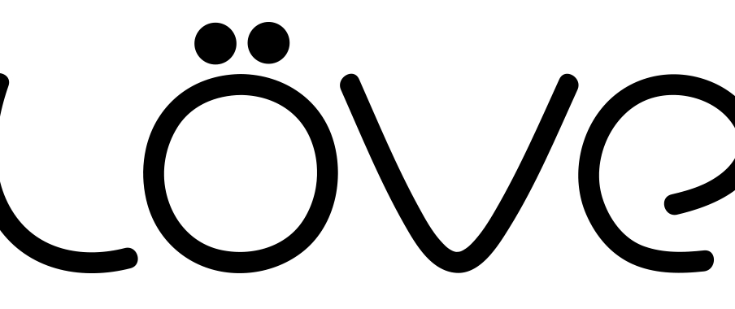

= Make a Shooter in Lua/Love2D - Setup and Player Movement
:keywords: games, gamedev, lua, love2d, software, coding, development, engineering, inclusive, community
:lang: en
:toc:
:toclevels: 3
:sectnums:
ifndef::env-github[:icons: font]
:note-caption: :paperclip:
:important-caption: :exclamation:
:warning-caption: :warning:

https://dev.to/jeansberg[Jens Genberg] +
Posted on 7. Juli 2017 +
https://dev.to/jeansberg/make-a-shooter-in-lualove2d---part-1

Hello! This will be the first in a series of posts on developing a
simple shoot 'em up game using the Lua programming language and the
`Love2D` framework. I decided to make this game as a bit of a break from
another game project that I've been working on for a while. I chose Lua
and `Love2D` due to their focus on simplicity and efficiency. I will be
writing these posts as I learn.

== Getting started

In order to run the game we are making, you need to install the `Love2D`
framework from https://love2d.org/[https://love2d.org]. You might also
want to use an IDE or a plugin for your favorite text editor to get
things such as autocomplete and syntax checking. Here is a list of such
http://www.gamefromscratch.com/post/2016/01/25/Editors-and-IDEs-for-Lua-and-Love-Development.aspx[tools].
Personally I went with the Atom Editor plugin, since Atom is currently
my favorite text editor.

== Let's write some code!

After we have our tools set up, the first thing we'll do is simply
create a folder containing a file named main.lua. This is where the
`Love2D` executable will look for the game code's entry point. This is
where we will put all our code for now.

We will start by writing three very important functions:

* `love.load()`
* `love.draw()`
* `love.update()`

These functions are called by the `Love2D` engine and are required to get
any of our code to run at all. The `load()` function is called exactly
once, when the game is started. The `draw()` function is called
continuously once the game is running and is where any graphics code
should be placed. The `update()` function is also called continuously and
is where the state of the game should be updated.

=== `love.load()`

[source,highlight,lua]
----
function love.load()
  xPos = 0
  yPos = 0
  playerWidth = 64
  playerHeight = 64
  playerSpeed = 200
  submarineImage = love.graphics.newImage("resources/images/submarine.png")
end
----

The `load()` function is the perfect place for all kinds of initialization
code. We start by defining some integer values for the position, size
and speed of the player. We then load an image located on the hard drive
- I'm using
https://github.com/jeansberg/GreatDeep/blob/master/resources/images/submarine.png[this
little pixel art submarine I drew]. This image will represent the player
in our game. Note that Lua is a dynamically typed language so we don't
need to declare any types for these variables.

=== `love.draw()`

[source,highlight,lua]
----
function love.draw()
  love.graphics.draw(submarineImage, xPos, yPos, 0, 2, 2)
end
----

For now, our `draw()` function will contain a single line of code to draw
the image at the player's current position. Normally you would only need
the image, x-position and y-position parameters. The three last
parameters are there because I wanted to make my tiny 32x32 pixel image
a little bit bigger. The 0 means that the image will not be rotated and
the 2s mean that the image's width and height are doubled.

=== `love.update()`

[source,highlight,lua]
----
function love.update(dt)
  downUp = love.keyboard.isDown("down") or love.keyboard.isDown("up")
  leftRight = love.keyboard.isDown("left") or love.keyboard.isDown("right")

  speed = playerSpeed
  if(downUp and leftRight) then
    speed = speed / math.sqrt(2)
  end

  if love.keyboard.isDown("down") and yPos<love.graphics.getHeight()-playerHeight then
    yPos = yPos + dt * speed
  elseif love.keyboard.isDown("up") and yPos>0 then
    yPos = yPos - dt * speed
  end

  if love.keyboard.isDown("right") and xPos<love.graphics.getWidth()-playerWidth then
    xPos = xPos + dt * speed
  elseif love.keyboard.isDown("left") and xPos>0 then
    xPos = xPos - dt * speed
  end
end
----

The `update()` function will contain code for listening to keyboard input
and moving the player around. You probably noticed that this function
takes a parameter called dt. This is passed to the function by the
`Love2D` engine and indicates how much time has passed since the last
`update()` call. This is used as a multiplier to determine how much our
variables should change. Without this adjustment, the speed of our game
would directly depend on the speed of the computer running it!

==== Input handling

We begin by using the built-in `keyboard.isDown()` function to check if
any arrow keys are currently being pressed. We store this information in
two variables. One will indicate whether the down or up key is being
pressed. The other one will do the same for the left and right keys. If
both of these values are true, it means the player will be moving
diagonally. In that case we need to divide the speed value with the
square root of two before we apply it to the x- and y-positions.
Otherwise diagonal movement would be much faster than horizontal or
vertical movement.

==== Movement constraints

We then check whether the down or up key is being pressed again (not the
most optimal code, but sufficient for a tutorial!). If the down key is
being pressed, we increment the y-position, since the y-coordinates
start at 0 at the top of the screen. We use dt as a multiplier as
mentioned above. It's not enough to merely check the player input
however. We don't want the submarine to disappear below the screen, so
we make sure the yPos variable is never greater than the height of the
screen minus the height of the player (the player width and height are
64 pixels since I doubled the width and height of the image when drawing
it). Similarly, we want to make sure that the submarine doesn't go above
the screen so we check that yPos is greater than zero. The code for
horizontal movement is very similar.

== Conclusion

You can now use `love.exe` which comes with the `Love2D` install to run the
game! Just make sure you give it the path to the folder containing your
main.lua file as a parameter. You should be able to control the
submarine with the arrow keys on your keyboard. If you're on a laptop
without arrow keys, simply change the `down`, `up`, `left` and `right`
parameters to some letter keys.

In the following post we will take a look at some shooting, so stay
tuned!

== Links

https://github.com/jeansberg/GreatDeep/blob/dfd04ebdf0e2084ecbb2d6de9bedcf7c697b77c0/main.lua[Source for part 1] +
https://github.com/jeansberg/GreatDeep[Latest source] +
https://love2d.org/wiki/Main_Page[Love2D wiki] +
https://www.lua.org/manual/5.1/[Lua reference]

