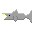
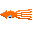
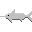
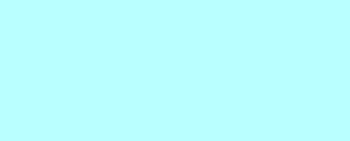

= Make a Shooter in Lua/Love2D - Enemies and Combat
:keywords: games, gamedev, lua, love2d, software, coding, development, engineering, inclusive, community
:lang: en
:toc:
:toclevels: 3
:sectnums:
ifndef::env-github[:icons: font]
:note-caption: :paperclip:
:important-caption: :exclamation:
:warning-caption: :warning:

image:images/title.png[Cover image for Make a Shooter in Lua/Love2D - Enemies and Combat,width=1000,height=420]

link:/jeansberg[Jens Genberg] +
Posted on Jul 17, 2017 +
https://dev.to/jeansberg/make-a-shooter-in-lualove2d---part-3

link:https://dev.to/jeansberg/make-a-shooter-in-lualove2d---part-2[Since we have now implemented shooting], it's time to introduce some enemies to our game. In this post I will show you how to add a few enemy types with different behaviors.

If you look at the https://github.com/jeansberg/GreatDeep/tree/3426d68ace29b3147d61e107deb22cf1c5e7d759[source code] at this stage, you can see I've added a few more lines to the `load()` function. These are fairly self-explanatory so we won't go through them here.

== Starting a new game

With the introduction of enemies comes the possibility of the player
being destroyed. When that happens, we need to reset the game. That's
why it's a good idea to move some of the initialization logic out of the
`load()` function into a function called `startGame()` for example. This way
we can start the game over whenever we want, simply by calling that
function. We will leave the image loading code and the constant values
in the `load()` function.

[source,highlight,lua]
----
function startGame()
  player = {xPos = 0, yPos = 0, width = 64, height = 64, speed=200, img=submarineImage}
  torpedoes = {}
  enemies = {}

  canFire = true
  torpedoTimer = torpedoTimerMax
  spawnTimer = 0
end
----

== Enemy logic

The enemy handling code contains a bit more logic than the player
movement and projectile code, since we have to give the enemies some
semblance of intelligence. It also took me a bit longer to write. Please
bear with me as I try to explain it function by function.

All right. First up is the `updateEnemies()` function which is called from
the main `update()` function. It's essentially responsible for adding and
removing objects much like the `updateTorpedoes()` function. It uses a
timer to control when a new enemy is spawned.

[source,highlight,lua]
----
function updateEnemies(dt)
  if spawnTimer > 0 then
    spawnTimer = spawnTimer - dt
  else
    spawnEnemy()
  end

  for i=table.getn(enemies), 1, -1 do
    enemy=enemies[i]
    enemy.update = enemy:update(dt)
    if enemy.xPos < -enemy.width then
      table.remove(enemies, i)
    end
  end
end
----

[NOTE]
====
You'll notice I changed the remove loop yet again. I am using a
https://www.lua.org/pil/4.3.4.html[numeric for loop] that iterates
through the objects from end to beginning. This is the most convenient
type of loop to use when you need to remove objects inside the loop.
====

== Prototypes

It's time to introduce some object-oriented programming concepts into
our code. Since we will be creating a large number of enemies, we want
them to be able to share some common properties. Lua uses something
called "metatables" to implement prototype-based inheritance. I won't go
through what happens in the background here - just know that the
following code defines an Enemy prototype with some default values as
well as a constructor function. The constructor function can then be
called with the desired arguments. If an argument is left out, the
corresponding key will use the default value defined in the prototype.

[source,highlight,lua]
----
Enemy = {xPos = love.graphics.getWidth(), yPos = 0, width = 64, height = 64}

function Enemy:new (o)
  o = o or {}
  setmetatable(o, self)
  self.__index = self
  return o
end
----

== Spawning enemies

Now let's look at how to use this in our `spawnEnemy()` function.

We start by using the `random()` function provided by Love2D. We first get
a random y-position for the new enemy which will always be between zero
and the height of the screen minus the height we use for our enemies. We
also ask for a number between zero and two, in order to determine the
type of enemy to spawn. We then call the `Enemy:new()` function,
overriding the yPos parameter and adding values for the "speed" and
"img" keys. If we wanted to, we could have defined defaults for these
keys in the prototype as well. The last argument we pass in will
actually be a function and not a field. Lua treats functions as objects,
so this is not a problem. After constructing the enemy, we add it to the
enemies table and reset the spawn timer.

[source,highlight,lua]
----
function spawnEnemy()
  y = love.math.random(0, love.graphics.getHeight() - 64)
  enemyType = love.math.random(0, 2)
  if enemyType == 0 then
    enemy = Enemy:new{yPos = y, speed = squidSpeed, img = squidImage, update=moveLeft}
  elseif enemyType == 1 then
    enemy = Enemy:new{yPos = y, speed = sharkSpeed, img = sharkImage, update=moveToPlayer}
  else
    enemy = Enemy:new{yPos = y, speed = swordfishSpeed, img = swordfishImage, update=chargePlayer}
  end
  table.insert(enemies, enemy)

  spawnTimer = spawnTimerMax
end
----

 +
 +

== Enemy behavior

The three different functions we assign to the "update" parameter in the
`spawnEnemy()` function will define the behavior of the enemies. The
function assigned to each enemy will be called from the `updateEnemies()`
method.

[source,highlight,lua]
----
enemy.update = enemy:update(dt)
----

I will explain their logic one by one.

[source,highlight,lua]
----
function moveLeft(obj, dt)
  obj.xPos = obj.xPos - obj.speed * dt
  return moveLeft
end
----

The `moveLeft()` function is the simplest behavior. It updates the `xPos`
value of the object it belongs to based on its speed value and the delta
time. Note that the object is implicitly passed in as the first
parameter which we call "obj". This function causes the enemy to move
left in a straight line.

[source,highlight,lua]
----
function moveToPlayer(obj, dt)
  xSpeed = math.sin(math.rad (60)) * obj.speed
  ySpeed = math.cos(math.rad (60)) * obj.speed
  if (obj.yPos - player.yPos) > 10 then
    obj.yPos = obj.yPos - ySpeed * dt
    obj.xPos = obj.xPos - xSpeed * dt
  elseif (obj.yPos - player.yPos) < -10 then
    obj.yPos = obj.yPos + ySpeed * dt
    obj.xPos = obj.xPos - xSpeed * dt
  else
    obj.xPos = obj.xPos - obj.speed * dt
  end
  return moveToPlayer
end
----

The `moveToPlayer()` function compares the vertical positions of the enemy
and the player. If the enemy position is more than ten pixels higher or
lower than the player position, the enemy moves diagonally toward the
player. Otherwise it keeps moving in a straight line. The reason we're
not comparing the exact positions is that it causes very jittery
movement. I also used some trigonometric functions in order to make the
enemy move at a less steep angle toward the player. I think this makes
the movement look less robotic, but that's a matter of taste.

[source,highlight,lua]
----
function chargePlayer(obj, dt)
  xDistance = math.abs(obj.xPos - player.xPos)
  yDistance = math.abs(obj.yPos - player.yPos)
  distance = math.sqrt(yDistance^2 + xDistance^2)
  if distance < 150 then
    obj.speed = chargeSpeed
    return moveLeft
  end 
  moveToPlayer(obj, dt)
  return chargePlayer
end
----

I'm sure you noticed that the result of the `update()` function is itself
assigned to the enemy's update key, every time it's called in
`updateEnemies()`. The purpose of this trick is to allow the behavior
functions to return either themselves or another function depending on
some condition. This is used in `chargePlayer()`. We first calculate the
distance to the player and if it's less than 200, we return the
`moveLeft()` function after increasing the speed of the enemy. If the
object is farther away, we call the `moveToPlayer()` function instead and
then return the `chargePlayer()` function. This causes any enemy with this
behavior to move toward the player and charge in a straight line when it
gets close!

== Collisions

We have now implemented shooting and enemy spawns, but these mechanics
don't interact with each other yet. We need to add some collision
checking code in order to detect when an enemy is actually hit by a
projectile, or when the player is attacked by an enemy.

[source,highlight,lua]
----
function checkCollisions()
  for index, enemy in ipairs(enemies) do
    if intersects(player, enemy) or intersects(enemy, player) then
      startGame()
    end

    for index2, torpedo in ipairs(torpedoes) do
      if intersects(enemy, torpedo) then
        table.remove(enemies, index)
        table.remove(torpedoes, index2)
        break
      end
    end
  end
end

function intersects(rect1, rect2)
  if rect1.xPos < rect2.xPos and rect1.xPos + rect1.width > rect2.xPos and
     rect1.yPos < rect2.yPos and rect1.yPos + rect1.height > rect2.yPos then
    return true
  else
    return false
  end
end
----

The `checkCollisions()` function is called in the main `update()` loop. It
calls the intersects() function to check if two objects are overlapping.
We first check for collisions between the player and all enemies. If a
collision is detected, we restart the game. Then we loop through each of
the torpedoes to see if it's touching an enemy. If so, we destroy both
the projectile and the enemy.

The link:https://dev.to/jeansberg/make-a-shooter-in-lualove2d---animations-and-particles[next and possibly final part of this tutorial] will focus on adding some more eye candy in the form of animations and particle effects. Please let me know if you have any questions or if I can explain something better!

== Links

https://github.com/jeansberg/GreatDeep/tree/3426d68ace29b3147d61e107deb22cf1c5e7d759/main.lua[Source - part 3] +
https://github.com/jeansberg/GreatDeep[Latest source] +
https://love2d.org/wiki/Main_Page[Love2D wiki] +
https://www.lua.org/manual/5.1/[Lua reference]
