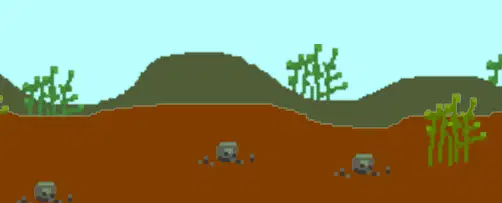

= Make a Shooter in Lua/Love2D - Animations and Particles
:keywords: games, gamedev, lua, love2d, software, coding, development, engineering, inclusive, community
:lang: en
:toc:
:toclevels: 3
:sectnums:
ifndef::env-github[:icons: font]
:note-caption: :paperclip:
:important-caption: :exclamation:
:warning-caption: :warning:

image:images/title.png[Cover image for Make a Shooter in Lua/Love2D - Animations and Particles,width=1000,height=420]

link:/jeansberg[Jens Genberg] +
Posted on Jul 21, 2017 +
https://dev.to/jeansberg/make-a-shooter-in-lualove2d---animations-and-particles

In the first three parts of this tutorial, we implemented link:https://dev.to/jeansberg/make-a-shooter-in-lualove2d---part-1[movement], link:https://dev.to/jeansberg/make-a-shooter-in-lualove2d---part-2[shooting], and link:https://dev.to/jeansberg/make-a-shooter-in-lualove2d---part-3[enemies], which means we now have a working, if basic, shoot 'em up. Now it's time to add some flair! In this post, I will go through animations, particle effects and scrolling backgrounds.

== Animations

At this point, the player and enemies are not animated. Their images are
simply moved across the screen. To make them a tiny bit more lifelike,
we will introduce a tilting animation for when they're moving
vertically.

[source,highlight,lua]
----
if down and player.yPos<love.graphics.getHeight()-player.height then
  player.yPos = player.yPos + dt * speed
  player.angle = 0.1
  player.pSystem:setLinearAcceleration(-75, -15, -150, -15)
elseif up and player.yPos>0 then
  player.yPos = player.yPos - dt * speed
  player.angle = -0.1
  player.pSystem:setLinearAcceleration(-75, 15, -150, 15)
else
  player.angle = 0
  player.pSystem:setLinearAcceleration(-75, 0, -150, 0)
end
----

We add an `angle` key to the player table, which we modify in the
`updatePlayer()` function. We then pass `player.angle` as the "orientation"
argument to the `draw()` function. Note that the angle is given in radians
and not degrees, which is why the numbers are so small.

[source,highlight,lua]
----
love.graphics.draw(player.img, player.xPos, player.yPos, player.angle, 2, 2)
----

We add similar code to the enemy behavior functions and the
`updateEnemies()` function.

I was thinking about adding some swimming animations to the enemies, but
decided that's not in the scope of this tutorial. To read more about
animations in `Love2D` you can check out
https://github.com/kikito/anim8[something like this].

== Particle effects

Particle systems are used in order to create effects like dust, smoke
and explosions in games. Particle systems emit a stream of particles
that move according to a set of variables. The particles are rendered
using either a basic shape or an image. We're going to use the particle
system functionality built into `Love2D` to create trails for the player
and torpedoes as well as explosions for player and enemy destruction.

=== Trails

We start by drawing an ellipse shape to get something looking like a
bubble, which will be used for our submarine and torpedo trails. Since
we want different sized particles we create a function that takes a size
parameter.

[source,highlight,lua]
----
function getBubble(size)
  local bubble = love.graphics.newCanvas(size, size)
  love.graphics.setCanvas(bubble)
  love.graphics.setColor(255, 255, 255, 255)
  love.graphics.ellipse("fill", size/2, size/2, size/2, size/4)
  love.graphics.setCanvas()
  return bubble
end
----

We create a new "canvas" object, which is Love2D's way of letting you
draw something "off-screen" for later use. We then draw a white ellipse
shape to the canvas and return it.

[source,highlight,lua]
----
function getBubbleTrail(image)
  pSystem = love.graphics.newParticleSystem(image, 50)
  pSystem:setParticleLifetime(1, 1)
  pSystem:setSpeed(-50)
  pSystem:setColors(255, 255, 255, 200, 255, 255, 255, 100, 255, 255, 255, 0)
  pSystem:setSizes(0.2, 0.8)
  return pSystem
end
----

The next step is to create a function that returns the actual particle
system. As arguments, we pass in an image and a limit for the number of
particles to be kept alive at the same time. We then set the lifetime of
the particles to one second and their speed to -50 since we want them to
spray toward the left of the screen. We set the color to draw the
particles - we pass in three color arguments in RGBA pairs, which will
make the opacity decrease to zero as the particle ages. Finally, we set
the size to vary between 0.2 and 0.8 and return the particle system.

[source,highlight,lua]
----
if(left) then
  player.pSystem:setEmissionRate(10)
elseif(right) then
  player.pSystem:setEmissionRate(20)
else
  player.pSystem:setEmissionRate(15)
end

player.pSystem:setPosition(player.xPos, player.yPos + player.height / 2)
player.pSystem:update(dt)
----

In the `updatePlayer()` function, we add some code to control the particle
emission rate in order to create more particles when the player
accelerates. We also set the position of the particle system to the rear
of the player. Then we call update on it, passing in the delta time.

[source,highlight,lua]
----
love.graphics.draw(player.pSystem, 0, 0)
----

Make sure to add the drawing code for the particle system as well, or we
won't see anything! We are drawing the system in the top left corner,
since it uses the value from `setPosition()` as an offset for the actual
particles.

If you look at the source code, you will see that the code for torpedo
trails is very similar.

=== Explosions

For the explosions, we create another function to return a circle shape
instead of an ellipse. We add a size parameter here as well, since we
want two different sizes.

[source,highlight,lua]
----
function getBlast(size)
  local blast = love.graphics.newCanvas(size, size)
  love.graphics.setCanvas(blast)
  love.graphics.setColor(255, 255, 255, 255)
  love.graphics.circle("fill", size/2, size/2, size/2)
  love.graphics.setCanvas()
  return blast
end
----

The function that returns the explosions particle system is also very
similar to the one returning the bubble trail system.

[source,highlight,lua]
----
function getExplosion(image)
  pSystem = love.graphics.newParticleSystem(image, 30)
  pSystem:setParticleLifetime(0.5, 0.5)
  pSystem:setLinearAcceleration(-100, -100, 100, 100)
  pSystem:setColors(255, 255, 0, 255, 255, 153, 51, 255, 64, 64, 64, 0)
  pSystem:setSizes(0.5, 0.5)
  return pSystem
end
----

Instead of just setting the speed of the particles, we use
`setLinearAcceleration()` to cause the explosion particles to randomly go
in different directions. We also set the color to go from yellow to
orange and then fade away to dark grey.

Then it's just a simple matter of adding new explosion particle systems
to an explosion table whenever an enemy or the player is destroyed. Note
that we're calling the `emit()` function now in order to create a single
burst of particles and not a continuous stream.

[source,highlight,lua]
----
local explosion = getExplosion(smallBlast)
explosion:setPosition(enemy.xPos + enemy.width/2, enemy.yPos + enemy.height/2)
explosion:emit(10)
table.insert(explosions, explosion)
----

[source,highlight,lua]
----
local explosion = getExplosion(blast)
explosion:setPosition(enemy.xPos + enemy.width/2, enemy.yPos + enemy.height/2)
explosion:emit(20)
table.insert(explosions, explosion)
----

We also add a function to update our explosions and remove them after
all the particles have been destroyed.

[source,highlight,lua]
----
function updateExplosions(dt)
  for i = table.getn(explosions), 1, -1 do
    local explosion = explosions[i]
    explosion:update(dt)
    if explosion:getCount() == 0 then
      table.remove(explosions, i)
    end
  end
end
----

[NOTE]
====
In the last part, we made the game restart as soon as the player was
destroyed. I modified this behavior by adding a "playerAlive" flag and a
short timer. Otherwise the player explosion wouldn't have time to
animate.
====

== Scrolling backgrounds

In order to make the background look more lively, I decided to draw a
sea floor and have that scroll along the bottom of the screen. I drew a
foreground image and a background image and loaded them up in the `load()`
function.

[source,highlight,lua]
----
if groundPosition > -800 then
  groundPosition = groundPosition - dt * 100
else
  groundPosition = 0
end
if backgroundPosition > -800 then
  backgroundPosition = backgroundPosition - dt * 50
else
  backgroundPosition = 0
end
----

Since we know the screen width is 800 pixels, we make the `groundPosition`
tick down from 0 to -800 and restart. The background image will be
moving slower, in order to add the illusion of depth. This is called
https://en.wikipedia.org/wiki/Parallax_scrolling[Parallax scrolling].

[source,highlight,lua]
----
love.graphics.setColor(100, 200, 200, 200)
love.graphics.draw(backgroundImage, backgroundPosition, 380, 0, 2, 2)
love.graphics.draw(backgroundImage, backgroundPosition + 800, 380, 0, 2, 2)
love.graphics.setColor(255, 255, 255, 255)
love.graphics.draw(groundImage, groundPosition, 400, 0, 2, 2)
love.graphics.draw(groundImage, groundPosition + 800, 400, 0, 2, 2)
----

In the `draw()` method, we need to draw both images twice with an 800
pixel offset to get them to scroll seamlessly. We modify the drawing
color before drawing the background image in order to make it a bit
dimmer and darker. Then we reset the color and draw the foreground image
like normal and there we go!

I have decided to make one final post dealing with link:https://dev.to/jeansberg/make-a-shooter-in-lualove2d---music-and-sound-effects[sound effects and music], so stay tuned and thank you for reading!

== Links

https://github.com/jeansberg/GreatDeep/blob/1f6a66f9eeed63e11cc696139060001ca774a0e7/main.lua[Source - part 4] +
https://github.com/jeansberg/GreatDeep[Latest source] +
https://love2d.org/wiki/Main_Page[Love2D wiki] +
https://www.lua.org/manual/5.1/[Lua reference]
